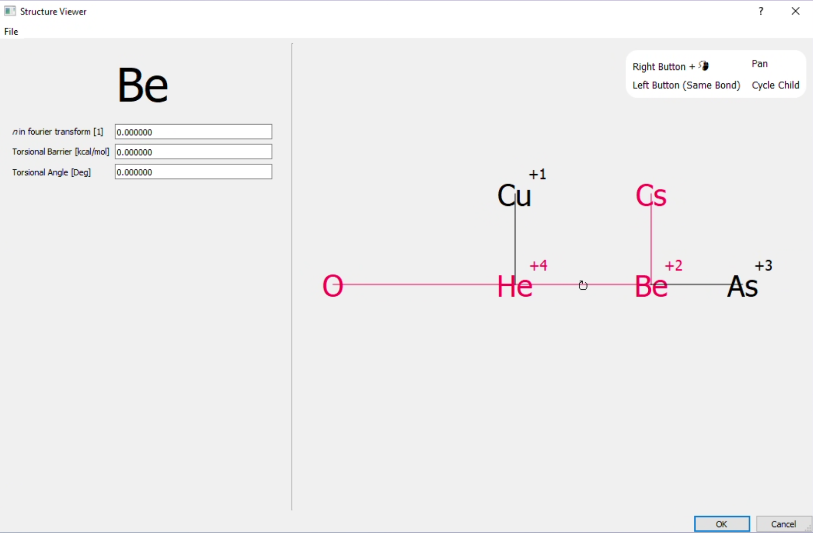
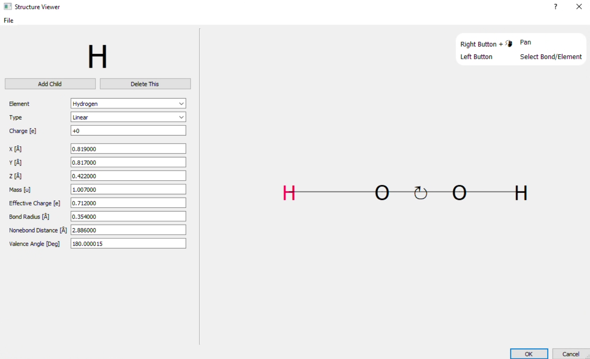
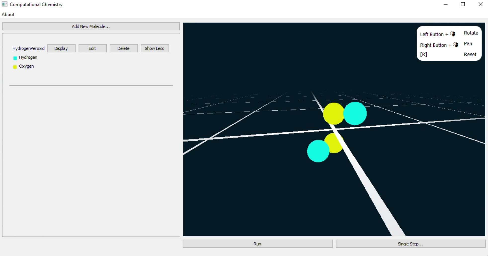
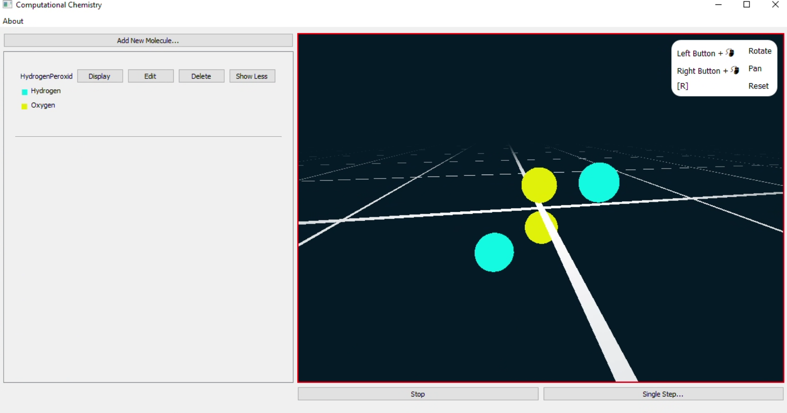

# Computational Chemistry

This project is a simulation of the internal motion of molecules created for and during my international baccalaureate computer science course as the internal assessment. This was created from 2020 to 2021 and uploaded only in 2022.

The acceleration each atom experiences due to the surrounding atoms is computed in parallel on the GPU enabling large molecules to be simulated. This simulation is based on a uniform force field approach from
*UFF, a full periodic table force field for molecular mechanics and molecular dynamics simulations A. K. Rappe, C. J. Casewit, K. S. Colwell, W. A. Goddard III, and W. M. Skiff
Journal of the American Chemical Society 1992 114 (25), 10024-10035
DOI: 10.1021/ja00051a040*

## Dependencies
* Qt5
* OpenCL (for Nvidia GPUs, this requires the "NVIDIA CUDA Toolkit")
* Glew

This project was written for and only tested on Windows, but in principle, the code should be portable to other platforms.

## Usage
The molecular structure is defined using a 2D interface that highlights bonds and torsions between atoms. The parameters for these are defined by selecting them in this interface.
The molecular properties can be stored in an XML-based format.

With the molecular structure and force field parameters defined, the molecule is simulated in 3D.

## Building
Building the project is straightforward through the Qt Creator; required includes are part of the repository. Note that the NVIDIA GPU Computing Toolkit path is hard coded in the project files - it may be required, if your CUDA version does not line up or you are using a different GPU, to change the path so that the OpenCL library can be found.

To run the application, both the `src/shaders` and `src/computation` folders need to be in the working directory of the application; either copy these folders next to the executable or change your launcher setting to make the `src` folder the executable's working directory.

## Examples
An arbitrary molecule being constructed in the 2D view, with the parameters for the torsional O-He-Be-Cs bond selected.

Hydrogen Peroxide being constructed in the 2d builder with the parameters of one of the Hydrogen atoms being adjusted

The same hydrogen atom in the 3D view before being simulated

The same hydrogen after the simulation has been run, the initial position of the hydrogen atoms in the 2D view has been chosen such that they are too close to the oxygen atoms. During the simulation, the hydrogen moves out until they reach an equilibrium position.

